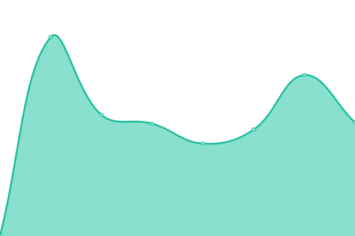
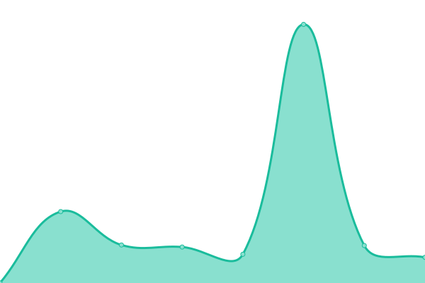

# [📈 Live Status](https://pandalabuptime.github.io/uptime): <!--live status--> **🟧 Partial outage**

This repository contains the open-source uptime monitor and status page for [PandaLab Uptime](https://pandalabuptime.github.io/uptime), powered by [Upptime](https://github.com/upptime/upptime).

With [Upptime](https://upptime.js.org), you can get your own unlimited and free uptime monitor and status page, powered entirely by a GitHub repository. We use [Issues](https://github.com/pandalabuptime/uptime/issues) as incident reports, [Actions](https://github.com/pandalabuptime/uptime/actions) as uptime monitors, and [Pages](https://pandalabuptime.github.io/uptime) for the status page.

<!--start: status pages-->
<!-- This summary is generated by Upptime (https://github.com/upptime/upptime) -->
<!-- Do not edit this manually, your changes will be overwritten -->
<!-- prettier-ignore -->
| URL | Status | History | Response Time | Uptime |
| --- | ------ | ------- | ------------- | ------ |
|  [Website](https://www.pandalab.fr) | 🟩 Up | [website.yml](https://github.com/pandalabuptime/uptime/commits/HEAD/history/website.yml) | 

 541ms
     
 | 

<a href="https://pandalabuptime.github.io/uptime/history/website">100.00%</a>
    

|  [Status](https://status.pandalab.fr) | 🟩 Up | [status.yml](https://github.com/pandalabuptime/uptime/commits/HEAD/history/status.yml) | 

 601ms
     
 | 

<a href="https://pandalabuptime.github.io/uptime/history/status">98.97%</a>
    

|  [CDN](https://cdn.pandalab.fr) | 🟩 Up | [cdn.yml](https://github.com/pandalabuptime/uptime/commits/HEAD/history/cdn.yml) | 

 515ms
     
 | 

<a href="https://pandalabuptime.github.io/uptime/history/cdn">100.00%</a>
    

|  [Test #A1](https://expired.badssl.com) | 🟥 Down | [test-a1.yml](https://github.com/pandalabuptime/uptime/commits/HEAD/history/test-a1.yml) | 

 0ms
     
 | 

<a href="https://pandalabuptime.github.io/uptime/history/test-a1">1.88%</a>
    

|  [Test #A2](https://idonotexist.net) | 🟥 Down | [test-a2.yml](https://github.com/pandalabuptime/uptime/commits/HEAD/history/test-a2.yml) | 

 0ms
     
 | 

<a href="https://pandalabuptime.github.io/uptime/history/test-a2">79.63%</a>
    

<!--end: status pages-->

[**Visit our status website →**](https://pandalabuptime.github.io/uptime)

## 📄 License

- Powered by: [Upptime](https://github.com/upptime/upptime)
- Code: [MIT](./LICENSE) © [PandaLab Uptime](https://pandalabuptime.github.io/uptime)
- Data in the `./history` directory: [Open Database License](https://opendatacommons.org/licenses/odbl/1-0/)
